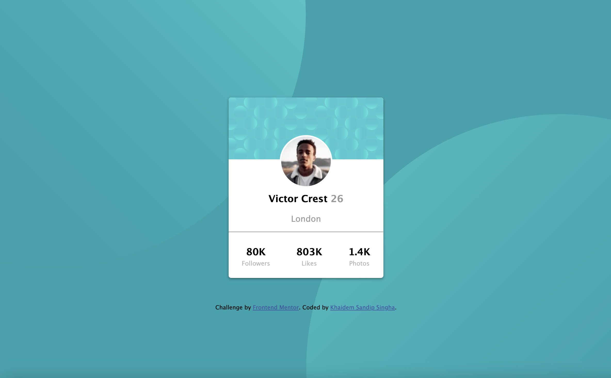

# Frontend Mentor - Profile card component solution

This is a solution to the [Profile card component challenge on Frontend Mentor](https://www.frontendmentor.io/challenges/profile-card-component-cfArpWshJ). Frontend Mentor challenges help you improve your coding skills by building realistic projects.

## Table of contents

- [Overview](#overview)
  - [The challenge](#the-challenge)
  - [Screenshot](#screenshot)
  - [Links](#links)
- [My process](#my-process)
  - [Built with](#built-with)
  - [What I learned](#what-i-learned)
  - [Useful resources](#useful-resources)
- [Author](#author)
- [Acknowledgments](#acknowledgments)

## Overview

It is a challenging project, even though the difficulty level is a newbie. The reason being I practise less HTML and CSS. These challenges are motivation and a guide to keep my design skills sharp and skilled.

### The challenge

- Build out the project to the designs provided

### Screenshot



### Links

- Solution URL: [Solution URL](https://github.com/Kurosakicoder/Profilecard-FrontEndMentor)
- Live Site URL: [Live Website](https://kurosakicoder.github.io/Profilecard-FrontEndMentor/)

## My process

I first built the HTML tag and experimented with every HTML class with CSS properties.

### Built with

- Semantic HTML5 markup
- CSS custom properties
- Flexbox

### What I learned

I am proud of learning CSS background-image properties

```css
body {
  margin: 0;
  background: url(./images/bg-pattern-top.svg),
    url(./images/bg-pattern-bottom.svg);
  background-position: right 50vw bottom 30vh, left 50vw top 30vh;
  background-color: rgb(25, 162, 174);
  background-repeat: no-repeat, no-repeat;
  background-attachment: fixed, fixed;
  background-size: auto;
  height: 100vh;
  font-family: "Lucida Sans", "Lucida Sans Regular", "Lucida Grande",
    "Lucida Sans Unicode", Geneva, Verdana, sans-serif;
}
```

### Useful resources

- [W3 Schools](https://www.w3schools.com/css/css3_backgrounds.asp) -
  There are many websites I have visited, and W3Schools is the most.
- [Github code](https://github.com/pilatopus/profile-card.github.io/blob/main/style.css) - When I could not change my background image CSS, I decided to look at someone else's code for the same project. It helps me solve my final hurdle.

## Author

- Website - [Khaidem Sandip Singha ](https://www.linkedin.com/in/khaidemsandip/)
- Frontend Mentor - [@Kurosakicoder](https://www.frontendmentor.io/profile/Kurosakicoder)
- Twitter - [@KurosakiCoder](https://twitter.com/KurosakiCoder)

## Acknowledgments

I have solved these challenge mainly by looking through my old CSS projects and websites like w3schools.

I got my final hurdle solved from [Github code](https://github.com/pilatopus/profile-card.github.io/blob/main/style.css).
